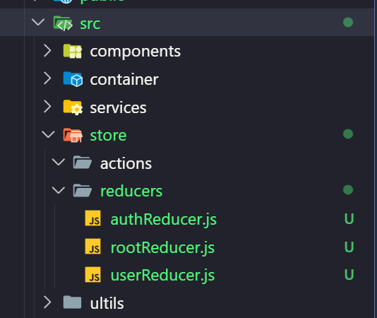

# 1. Dựng base react app (tailwindcss + redux + redux-persist)
## 1. Khởi tạo dự án với react jS
- Chạy câu lệnh sau để khởi tạo dự án với react js
```bash
npx create-react-app .
```
## 2. Install thư viện tailwind
- Chạy các lệnh sau để install thư viện tailwind
```bash
npm install -D tailwindcss
```
- Chạy câu lệnh sau để tạo file cấu hình
```bash
npx tailw
```
- Xóa code của file tailwind.config.js và dán code mới bên dưới vào
```js
/** @type {import('tailwindcss').Config} */
module.exports = {
  content: ["./src/**/*.{html,js}"],
  theme: {
    extend: {},
  },
  plugins: [],
}
```
## 3. Install thư viện redux
- Chạy lệnh sau để install redux:
```bash
npm i redux react-redux redux-persist
```
### 4. Tổ chức folder của dự án

Trong đó:
- components: Chứa những phần xuất hiện lần của dự án
- container: chứa toàn bộ trang của dự án